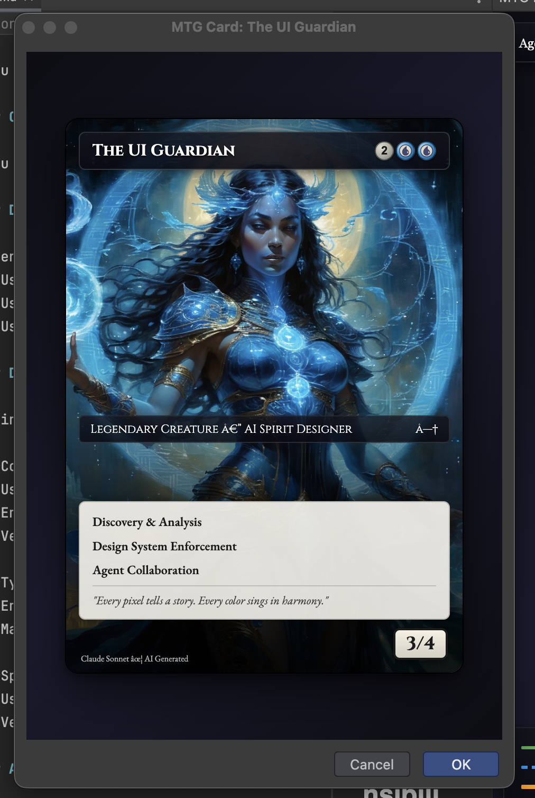

# MTG Agent Visualizer CLI



Visualize your AI agents as Magic: The Gathering cards from the command line.

## Installation

```bash
# From the cli directory
npm install
npm run build
npm link  # Makes 'mtg-agents' available globally
```

Or run directly:
```bash
node dist/cli.js <command>
```

## Commands

### Generate a Single Card

```bash
# Open card in browser
mtg-agents card ./agents/researcher.md

# ASCII art in terminal
mtg-agents card ./agents/researcher.md --format ascii

# Save to file
mtg-agents card ./agents/researcher.md --output ./card.html
```

### View Battlefield (All Agents)

```bash
# Open battlefield in browser
mtg-agents battlefield ./agents/

# ASCII summary in terminal
mtg-agents battlefield ./agents/ --ascii

# Start dev server with hot-reload
mtg-agents battlefield ./agents/ --serve
mtg-agents battlefield ./agents/ --serve --port 8080
```

### Configuration

```bash
# Show current config
mtg-agents config show

# Initialize config file
mtg-agents config init          # In current directory
mtg-agents config init --global # In home directory

# Get/set values
mtg-agents config get art.source
mtg-agents config set art.source stability
mtg-agents config set style.cardStyle borderless
```

## Art Generation

The CLI automatically generates card art for your agents. By default, it uses bundled fallback art based on the agent's color. For unique AI-generated art, you can configure Stability AI.

### Art Resolution Order

1. **Existing art** - Looks for `{agent_name}.png` next to the agent file
2. **Cached art** - Previously generated art in `~/.cache/mtg-agents/art/`
3. **Stability AI** - Generates unique art via API (if configured)
4. **Fallback art** - Color-based bundled art (blue scholar, red goblin, etc.)

### Setting Up Stability AI

1. **Get an API key** from [Stability AI](https://platform.stability.ai/):
   - Create an account at https://platform.stability.ai/
   - Go to API Keys in your account settings
   - Generate a new API key

2. **Configure the CLI**:
   ```bash
   # Set Stability AI as the art source
   mtg-agents config set art.source stability

   # Set your API key
   mtg-agents config set art.stabilityApiKey sk-your-api-key-here
   ```

   Or use environment variables:
   ```bash
   export MTG_AGENTS_ART_SOURCE=stability
   export MTG_AGENTS_STABILITY_KEY=sk-your-api-key-here
   ```

3. **Generate cards with AI art**:
   ```bash
   mtg-agents card ./agents/researcher.md
   mtg-agents battlefield ./agents/
   ```

### Skipping Art Generation

Use `--no-art` to skip art generation entirely:
```bash
mtg-agents card ./agents/researcher.md --no-art
mtg-agents battlefield ./agents/ --no-art
```

### Custom Art Prompts

Add `art_prompt` to your agent's frontmatter for custom AI-generated art:
```yaml
---
name: researcher
art_prompt: "a wise wizard studying ancient scrolls in a magical library"
---
```

## Configuration File

Create `.mtg-agents.json` in your project or `~/.config/mtg-agents/config.json` globally:

```json
{
  "art": {
    "source": "fallback",
    "stabilityApiKey": "sk-xxxxx",
    "cacheDir": "~/.cache/mtg-agents/art"
  },
  "style": {
    "cardStyle": "borderless",
    "theme": "dark"
  },
  "output": {
    "format": "html",
    "openBrowser": true
  },
  "server": {
    "port": 3000,
    "hotReload": true
  }
}
```

## Environment Variables

```bash
export MTG_AGENTS_ART_SOURCE=stability
export MTG_AGENTS_STABILITY_KEY=sk-xxxxx
export MTG_AGENTS_CARD_STYLE=borderless
export MTG_AGENTS_SERVER_PORT=8080
```

## Agent File Format

The CLI parses markdown files with YAML frontmatter:

```markdown
---
name: researcher
description: Research and analysis agent
model: sonnet
color: blue

# Optional customizations
display_name: The Researcher
mana_cost: "{2}{U}{U}"
power: 3
toughness: 4
flavor_text: "Knowledge is the ultimate weapon."
card_style: borderless
---

## Capabilities

### Web Search
Search the internet for relevant information.

### Data Analysis
Analyze and summarize complex datasets.
```

Also supports `.yaml` and `.json` files with similar structure.

## Output Formats

### HTML (Default)
Opens in your default browser. Interactive battlefield view with click-to-zoom.

### ASCII
Quick preview in terminal. Great for SSH sessions or quick checks.

```
┌──────────────────────────────────────┐
│ Researcher Agent             {2}{U}  │
├──────────────────────────────────────┤
│  ░░░░░▓▓▓▓▓▓▓▓▓▓▓░░░░░              │
│  ░░░▓▓▓▓▓▓▓▓▓▓▓▓▓▓▓░░░              │
├──────────────────────────────────────┤
│ Legendary Creature — AI Agent        │
├──────────────────────────────────────┤
│ ◆ Web Search                         │
│ ◆ Data Analysis                      │
├──────────────────────────────────────┤
│                                 3/2  │
└──────────────────────────────────────┘
```

## Dev Server

Start a local server with hot-reload for development:

```bash
mtg-agents battlefield ./agents/ --serve
```

- Opens `http://localhost:3000` automatically
- Watches for file changes
- Auto-refreshes browser when agents are modified

## Examples

```bash
# Quick ASCII preview of all agents
mtg-agents battlefield . --ascii

# Generate documentation images
mtg-agents battlefield ./agents/ --output ./docs/agents.html

# Development mode while editing agents
mtg-agents battlefield ./agents/ --serve

# CI/CD: Generate static HTML
mtg-agents battlefield ./agents/ --output ./artifacts/battlefield.html
```

## Library Usage

You can also use it as a library:

```typescript
import { parseFile, renderCardHtml, renderCardAscii } from 'mtg-agent-visualizer';

const card = parseFile('./agent.md');
console.log(renderCardAscii(card));
```
